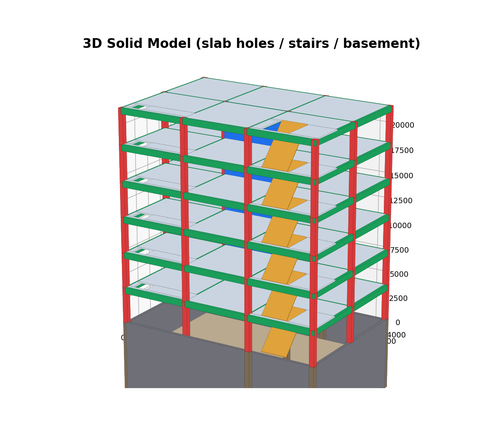
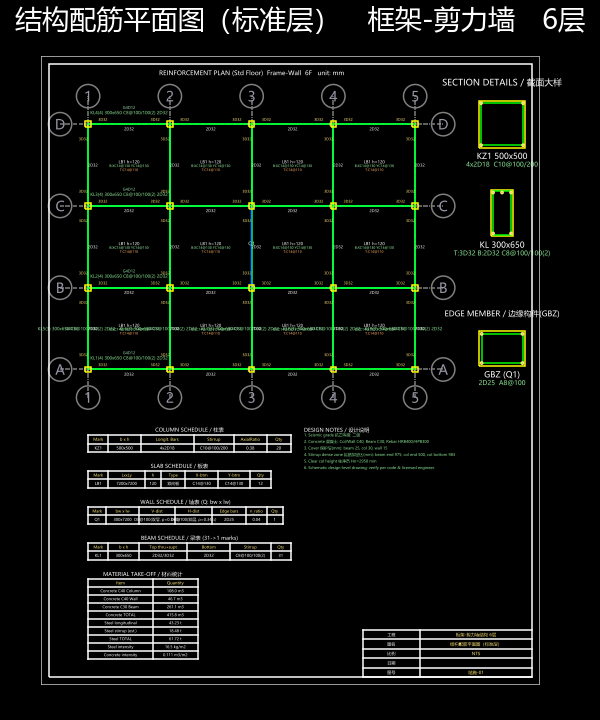
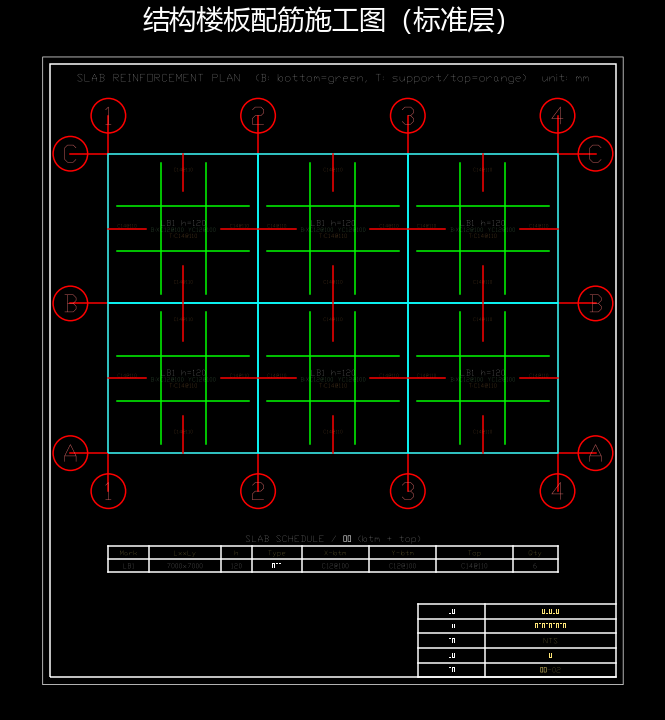
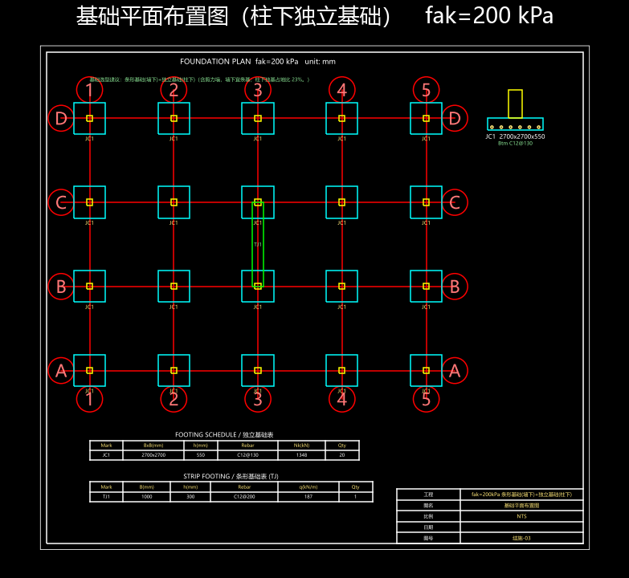

# structdesign · 开源智能结构设计软件

[](LICENSE)


**面向工程的智能结构设计软件**：导入图纸 / 自然语言建模 → 自动分析（杆系有限元 + 反应谱 + CQC + P‑Δ）→ 自动配筋与截面优化 → 出施工图与专业计算书。界面贴近 AutoCAD / YJK，结构工程师几乎零迁移成本；内置 **AI 助手**，一句中文即可改模型、改荷载、改设计规则。

> **算得准**（解析解/守恒律验证）· **容易用**（AI + 类 CAD/YJK 界面）· **便宜安全**（开源免费、本地离线、数据不出门）

## 🧭 演进方向：「衡 / HENG」多国规范智能结构计算平台

本项目正按《衡·多国规范智能结构计算平台产品设计书》演进，把"规范从代码里剥离成数据"。已落地平台层 `heng/`：

- **L3 规范引擎（Code-as-Data）** `heng/codes/`：受限 DSL（非图灵完备、可静态审计）+ 规则记录（rule_id/scope/公式/**条文溯源**/版本谱系/**自带算例**）+ **辖区解析器**（CN/EU/JP/US 生效规范集，确定性）+ 多国并行校核 + Eurocode **NDP 参数覆盖层**。
- **L1 单一结构语义模型 SSM** `heng/ssm.py`：语义模型 + **Git 式版本化**（commit/branch/tag/diff → 送审版本 diff 自动生成**修改对照表**）+ 审计日志。
- **审查包 + 强条自查表** `heng/review.py`：签名 SSM 快照 + 强制性条文自查（**强条零容忍红线**、签名门禁），直连"强条漏检=0"指标。

规范引擎判定与原硬编码校核**等价**（`test_heng_bridge`），并带来玻璃盒溯源。规范库 CI：每条规则跑自带算例（`test_heng_rules`）。详见 [重构计划](docs/heng/HENG-重构计划.md)。

## 📖 文档

- **[图文使用说明书](docs/manual/使用说明书.md)** —— 以一栋 6 层框架为例，从建模到出图全流程实操（[Word 版](docs/manual/使用说明书.docx)）
- **[软件介绍](docs/intro/软件介绍.md)** —— 算得准 / 容易用 / 便宜安全（[Word 版](docs/intro/软件介绍.docx)）
- **[「衡」重构计划](docs/heng/HENG-重构计划.md)** —— 五层架构映射与实施进度

---

## ✨ 主要功能

- **建模**：导入 DWG/DXF 底图并**按图层自动识别**柱/墙/梁/轴网；一键轴网 + 一键楼板；多标准层 / 大底盘多塔 / 拼接检验 / 自动转换梁；板洞、墙洞（开窗）、楼梯、结构缝；CAD 编辑（选择/框选/撤销/复制/镜像/阵列）。
- **荷载与分析**：风荷载（GB 50009）、活荷折减、温度作用、竖向地震；三维模态（周期比）、双向反应谱 CQC、P‑Δ、位移比、层间位移角；弹性/半刚性楼盖周期对比。
- **配筋与优化**：梁/柱双偏压/墙肢配筋；选试算风格 → 自动迭代加大/减小截面至满足规范并省料。
- **出图**：配筋平面图（柱表/墙表/梁表 + 逐跨原位标注 + 跨构件钢筋归并）、板施工图、基础图（独基/条基/筏板/桩基 + 选型建议）、楼梯图（DXF + PDF + PNG）；3D 实体 / 荷载分布 / 利用率云图 / 变形 / **振型动画（含扭转）**。
- **计算书**：专业结构计算书（Markdown + Word），含各专项与诚实边界说明。
- **AI 助手**：中文自然语言直接驱动，例如「标准层所有板 恒载5 活载2」「所有窗户从中心扩大200」「梁纵筋取大包罗」「改用北京地标」——**当场改模型、计算与图纸同步生效**。离线内置中文意图解析；配置 API Key 即升级为大模型对话。
- **钢结构工具箱**：型钢梁/柱按 GB 50017 验算（强度/稳定/长细比/挠度）。
- **地区标准**：国标基线 + 地方标准（已内置北京，可逐步扩展）。

## 🖼 截图

| 三维实体（板洞/楼梯/地下室） | 配筋平面图 |
|---|---|
|  |  |

| 板施工图 | 基础图（独基+条基+选型） |
|---|---|
|  |  |

## 🚀 快速开始

```bash
pip install -r requirements.txt          # Python 3.9 建议
python launch_modeler.py                 # 桌面建模器（PyQt5）
python run_app.py                        # 参数式 Web 计算界面（Flask）→ http://127.0.0.1:5000
python demo_project_3d.py                # 三维一键总流程示例 → 计算书(docx)
```

运行测试（每个测试文件可独立运行，内含解析解/守恒律手算）：

```bash
# PowerShell
Get-ChildItem tests\test_*.py | % { python $_.FullName }
# bash
for t in tests/test_*.py; do python "$t"; done
```

## 🧱 架构（数据自下而上）

```
L7 交付  计算书(md+Word) · 施工图(平法 SVG/DXF · 大样 · 轴测 · 曲线)
L6 调度  截面自动生长闭环（分析→校核→生长→重分析→收敛）
L5 内核  GB 50010 梁/柱/墙/裂缝挠度/地下室 · 抗震能力设计/扭转
L4 分派  规范公式→无依据处有限元→有依据工程方法；凡决策必留痕
L3 内力  荷载组合/包络 · 模态/反应谱/CQC/P-Δ/位移比
L2 模型  统一结构模型 USM · 建筑可行域
L1 引擎  自研杆系有限元（frame2d/frame3d） ‖ 可插拔分析引擎骨架
```

## ✅ 算得准（验证驱动）

每个功能上线前先用**解析解**或**守恒律**验证：悬臂挠度 `PH³/3EI`、简支跨中 `wL²/8`、欧拉临界力、模态对称楼 X/Y 解耦、CQC、风压高度系数与 GB 50009 表逐点吻合、钢结构稳定系数（附录 D）、荷载守恒、平行轴定理…… 全套 **219 个验证测试**通过。

## ⚖️ 诚实边界

本软件为**方案/初步设计**深度的开源原型。刚性楼盖、等效宽柱、CQC/楼层剖面部分近似等简化均在计算书中如实标注；弹性楼板的面内内力重分配、基础沉降等需更深内核或地勘数据，尚未实现并已注明。**施工图最终须商业三维软件复核 + 注册结构工程师签字。**

## 🤝 共建

欢迎提交 Issue / PR。开发约定见 [CONTRIBUTING.md](CONTRIBUTING.md)：规范公式优先、凡决策留痕、新功能须配解析解/守恒律测试。

## 📄 许可

[Apache License 2.0](LICENSE) —— 可免费用于商业与非商业（含设计院内部使用），保留版权与 NOTICE 即可。
