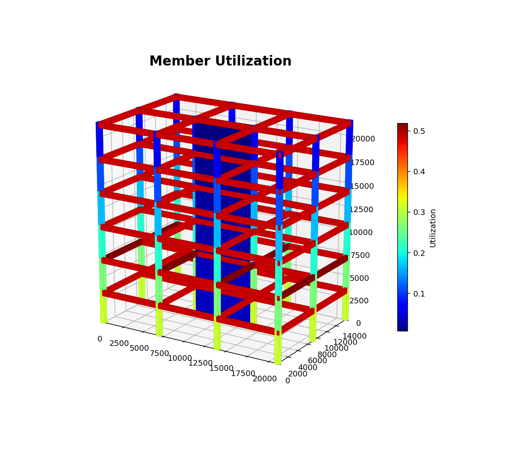
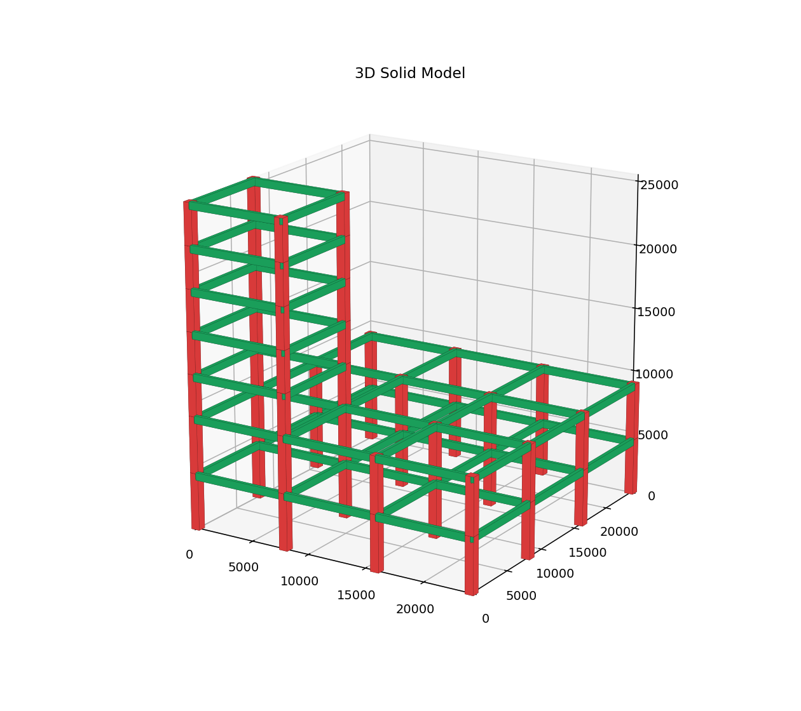

# 一句话

**structdesign** 是一套面向工程的智能结构设计软件原型：从**导入图纸 / 自然语言建模**，到**自动分析（杆系有限元 + 反应谱 + CQC + P‑Δ）**、**自动配筋与截面优化**，再到**出施工图与专业计算书**，一条龙打通。界面贴近 CAD / YJK，结构师几乎零迁移成本；内置 **AI 助手**，一句话就能改模型、改荷载、改设计规则。

> 我们的初心很简单：**让算得准这件事不再焦虑，让买软件这件事不再肉疼。**

---

# 一、算得准 —— 每一个数都有出处，每一个功能都被验证

软件遵循三条铁律：**规范公式优先 → 无依据处用有限元 → 凡决策必留痕**。更重要的是 **验证驱动**：每个功能上线前，都要先用**解析解**或**守恒律**把它"考"一遍。

- 全套 **219 个验证测试**（56 个测试文件）**全部通过**，覆盖：
  - 悬臂挠度 `PH³/3EI`、简支跨中弯矩 `wL²/8`、欧拉临界力 `Pcr`（与闭式解逐位比对）；
  - 模态分析对称楼 X/Y 解耦、CQC 平动‑扭转耦联、反应谱基底剪力方向分量；
  - 风荷载 μz 与《GB 50009》表 8.2.1 锚点逐点吻合、竖向地震 `F_Evk=0.65·αmax·0.75·Geq` 量级手算复核；
  - 钢结构 φ 稳定系数（《GB 50017》附录 D）、截面特性由板件几何积分（与型钢表差 <3%、偏安全）；
  - 荷载守恒、平行轴定理、温度等效荷载自平衡 …
- 依据规范：**GB 50010 / 50011 / 50009 / JGJ 3 / GB 50017**，并支持**地区标准**（已内置北京，其它城市可逐步加入）。

> **诚实边界**：本软件定位"方案 / 初步设计"深度；刚性楼盖、等效宽柱等简化均在计算书中如实标注；
> 施工图最终须商业三维软件复核 + 注册结构工程师签字。我们不回避边界——**写清楚，才靠得住。**

---

# 二、容易用 —— 像 CAD 一样上手，像聊天一样建模

界面布局刻意贴近 **AutoCAD / YJK**：顶部分组工具条（文件 / 建模 / 编辑 / 分析 / 出图 / 工具），中央绘图区，右侧"属性 / AI 助手"选项卡，底部计算结果。**老结构师几乎不用学。**

- **导入即用**：导入 DWG/DXF 底图，"🔎 识别构件"按图层自动生成柱 / 墙 / 梁 / 轴网；或"一键轴网 + 一键楼板"。
- **🤖 AI 助手（真正会执行）**：用中文直接下指令，软件**当场改模型、改荷载、改规则**——
  - 「标准层所有板，恒载 5、活载 2」→ 即刻设好楼面荷载；
  - 「所有窗户从中心扩大 200」→ 墙洞批量改尺寸；
  - 「梁纵筋取大包罗」→ 同截面梁统一最大配筋，**计算和图纸同步生效**；
  - 「改用北京地标」→ 自动套用北京的地震、风压参数。
  - 离线也能用（内置中文意图解析）；填入 API Key 即升级为大模型对话。
- **一键到底**：选试算风格（经济 / 均衡 / 稳健）→ 自动迭代加大 / 减小截面 → 满足规范且省料 → 出配筋图 + 计算书。
- **出图齐全**：配筋平面图（柱表 / 墙表 / 梁表 · 跨构件钢筋归并）、板施工图、基础图、楼梯图（DXF + PDF + PNG），以及 3D 实体 / 荷载分布 / **振型动画（含扭转旋转）**。

---

# 三、便宜安全 —— 开源共建，本地运行，数据不出门

- **便宜**：开源、免费。商业结构软件动辄数万元 / 年 / 节点，对中小设计院是实打实的成本压力；structdesign 让团队把预算花在刀刃上。
- **安全**：纯**本地离线运行**，模型与图纸**不上传任何云端**，不担心项目数据外泄；无加密狗、无联网授权，断网照常工作。
- **共建**：代码、规范实现、验证测试全部公开，谁都能看懂、能复核、能贡献。**规范在进步，软件就在进步**——这是一套"长出来"的软件，而不是"卖给你"的黑盒。

---

# 我们想做的事

结构设计师的焦虑，常常来自"这个数到底对不对"和"软件又要续费了"。
我们希望 structdesign 能接住这两份焦虑的一部分：

> **把"算得准"做成可验证的事实，把"用得起"做成开源的承诺。**

让工程师把精力放回**判断与创造**，把重复、试错、出图的体力活交给软件。

---

*structdesign · 方案/初步设计级开源结构设计软件 · 须经注册结构工程师复核签字后用于工程。*
