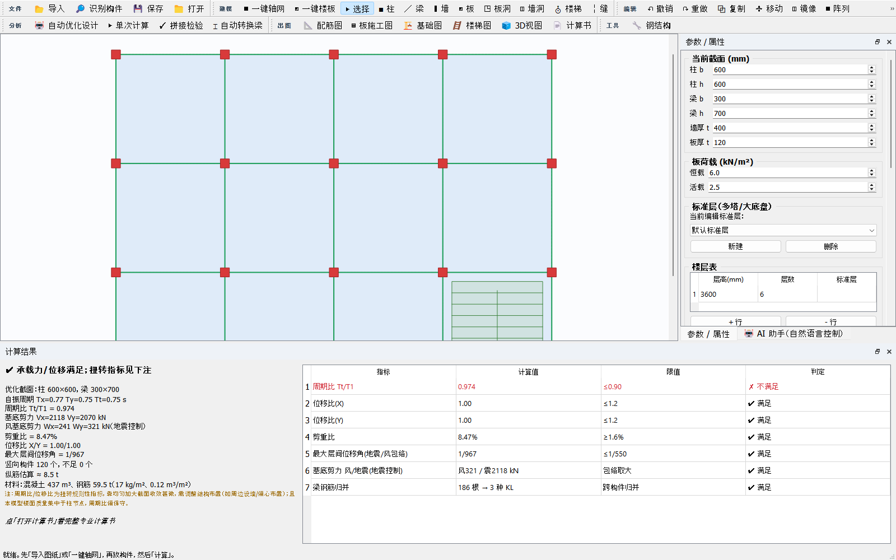
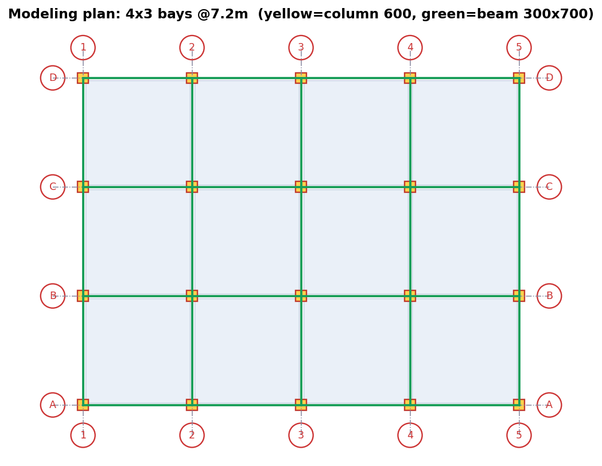
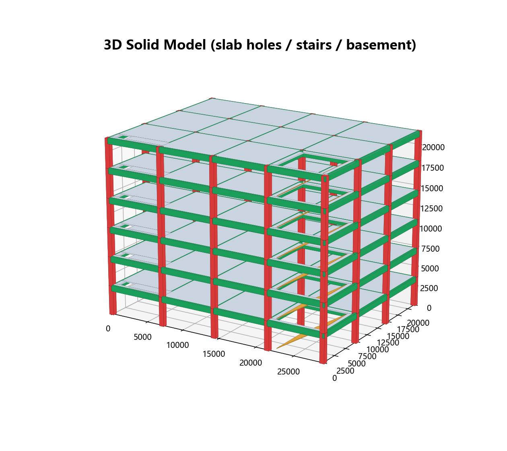
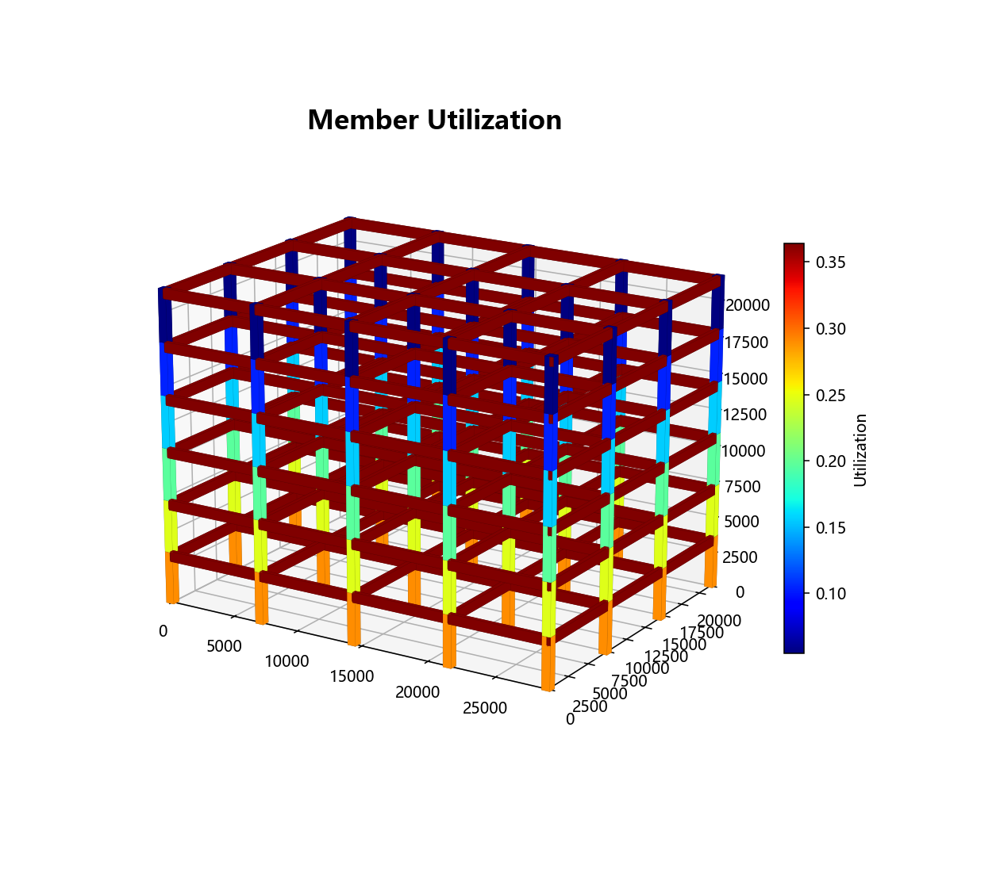
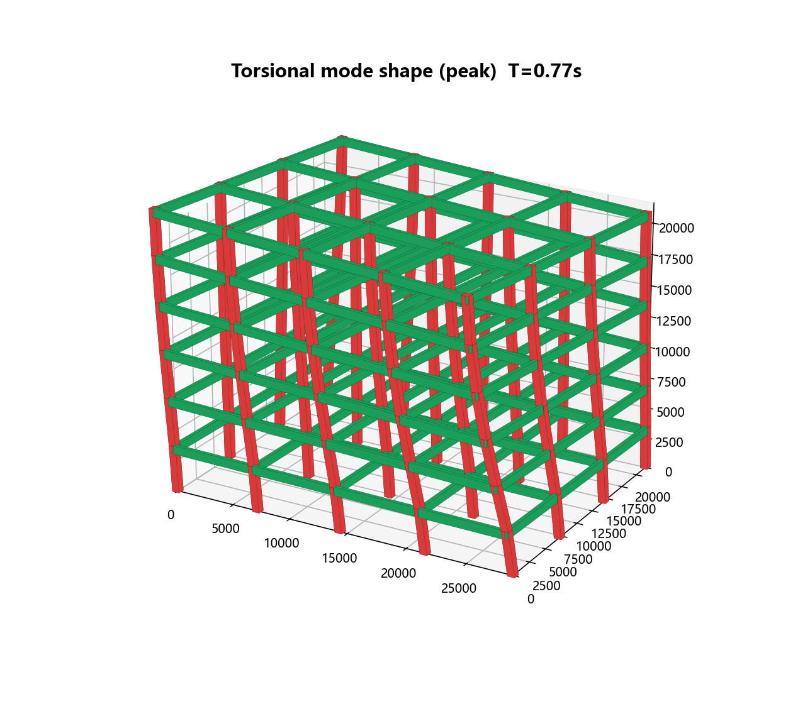
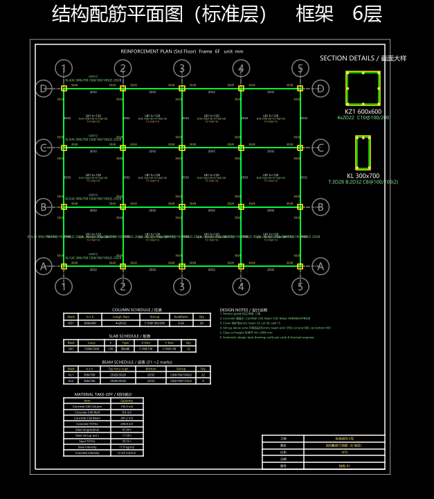
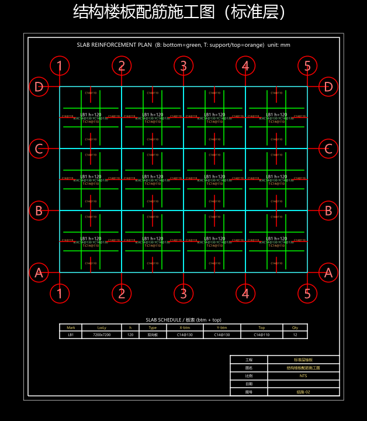
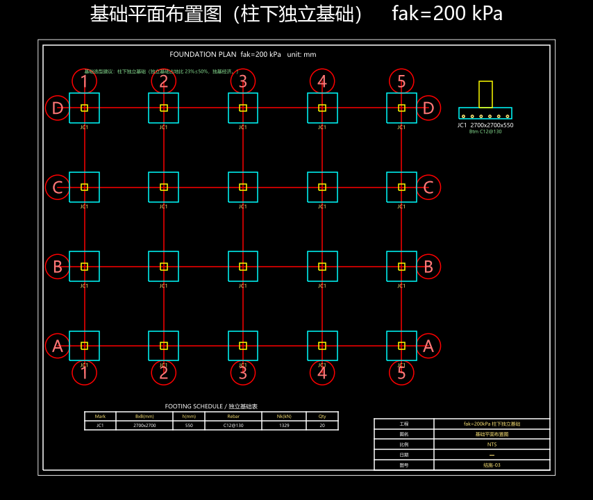

# 写在前面

本说明书用**一个完整工程实例**，带你走一遍 structdesign 的全流程：

> **实例**：6 层钢筋混凝土框架，平面 4×3 跨、柱距 7.2 m，层高 3.6 m；柱 600×600、梁 300×700、板厚 120；楼面恒载 6.0、活载 2.5 kN/m²；北京地区。（纯框架；如需剪力墙见 2.2，可选）

跟着做完，你就掌握了：**建模 → 设参数 → （可选）AI 助手 → 自动优化 → 看结果 → 出施工图 → 出计算书**。

本软件为**方案/初步设计**深度的开源工具；结果须经注册结构工程师复核签字后用于工程。

---

# 0. 安装与启动

1. 把 `structdesign_modeler_安装版.zip` **完整解压**到任意目录。
2. 双击 **`安装.bat`** —— 自动安装到当前用户目录、创建桌面快捷方式（无需管理员、无需联网）。
3. 双击桌面 **"structdesign modeler"** 启动。
   （也可不安装：进入 `structdesign_modeler` 文件夹双击 `structdesign_modeler.exe`。）

> 程序生成的图纸/计算书默认写到 `C:\Users\你的用户名\structdesign_work\`，出图时也会弹框可另存。

---

# 1. 界面总览

启动后是经典的 CAD/YJK 式布局：



- **① 顶部工具条**（分组）：`文件` `建模` `编辑` `分析` `出图` `工具`，常用命令一目了然。
- **② 中央绘图区**：画轴网、柱、梁、墙、板；支持点选/框选、缩放、平移。
- **③ 右侧选项卡**：`参数/属性`（截面、荷载、楼层表、工程地区、地震、风、温度、地下室）与 `🤖 AI 助手`。
- **④ 底部计算结果**：规范指标表（周期比、位移比、剪重比、层间位移角…）。

主要工具按钮：

| 分组 | 按钮 | 作用 |
|---|---|---|
| 文件 | 📂导入 / 🔎识别构件 / 💾保存 / 📁打开 | 导入 DWG/DXF、按图层自动识别构件 |
| 建模 | ▦一键轴网 / ▣一键楼板 / 柱·梁·墙·板·板洞·墙洞·楼梯·缝 | 快速与手动建模 |
| 编辑 | 撤销/重做/复制/移动/镜像/阵列/删除 | CAD 式编辑 |
| 分析 | 🤖自动优化设计 / ▶单次计算 / ✓拼接检验 / ⌶自动转换梁 | 计算与优化 |
| 出图 | 📐配筋图 / ▤板施工图 / 🏗基础图 / 🪜楼梯图 / 🧊3D视图 / 📄计算书 | 成果输出 |
| 工具 | 🔧钢结构 | 型钢梁/柱 GB 50017 验算 |

---

# 2. 建模

## 2.1 一键轴网

点 **`建模 → ▦ 一键轴网`**，在对话框填：X 向 4 跨、Y 向 3 跨、柱距 7200，柱 600×600、梁 300×700 → 确定。软件自动生成轴网 + 柱 + 梁：



## 2.2 一键楼板 / 墙 / 楼梯 / 板洞

- **`▣ 一键楼板`**：按轴网各区格自动布板（板厚默认 120）。
- **墙**：选 `▮ 墙` 工具，在中部 ⓂⒷ–ⓂⒸ 之间画一道剪力墙（厚 300）。
- **楼梯**：选 `⛢ 楼梯`，在右下角区格框选 → 生成板式双跑楼梯。
- **板洞**：选 `◳ 板洞`，框选需开洞处（如楼梯间）。

> 编辑技巧：`选择` 工具点选/框选构件后，可 `复制/移动/镜像/阵列`；`Ctrl+Z` 撤销、`Ctrl+Y` 重做。

---

# 3. 设置参数

切到右侧 **`参数/属性`** 选项卡：

1. **工程地区**：下拉选 **"北京"** —— 软件自动填入北京的抗震 αmax=0.16、Tg=0.40s、基本风压 w0=0.45、地面粗糙度 C（其它城市可后续扩展）。
2. **荷载**：恒载 6.0、活载 2.5 kN/m²。
3. **地震参数**：抗震等级（如二级）、振型数 12；如需可勾选"竖向地震"。
4. **风荷载**：勾选"计入风荷载"（已随地区填好 w0）。
5. **温度/地下室**：本例不勾选（有伸缩缝的常规建筑可不计温度）。

---

# 4. 🤖 AI 助手（用一句话改模型）

切到 **`🤖 AI 助手`** 选项卡，直接用中文下指令，软件**当场执行**并刷新模型/参数。试试：

| 你输入 | 软件执行 |
|---|---|
| `标准层所有板 恒载6 活载3` | 设好楼面荷载 |
| `所有窗户从中心扩大200` | 墙洞批量改尺寸 |
| `梁纵筋取大包罗` | 同截面梁统一最大配筋（计算与图纸同步） |
| `改用北京地标` | 套用北京地震/风参数 |

> 离线即可用（内置中文意图解析）；若在"AI 助手"里填入 API Key，则升级为大模型自由对话。指令含"计算/算一下"时会自动触发计算。

---

# 5. 自动优化设计（一键到底）

点 **`分析 → 🤖 自动优化设计`**，在弹窗选试算风格：

- **试算风格**：经济（最省料）/ 均衡（推荐）/ 稳健（留裕度）
- **截面策略**：全优化（自动加大+减小）/ 只加大到满足 / 只配筋
- **控制重点**：标准 / 严格

点确定后，软件**自动迭代**：分析 → 校核（承载力/层间位移角/剪重比）→ 加大或减小截面 → 重分析 …… 直到满足规范并尽量省料，最后自动出配筋与计算书。底部"计算结果"实时刷新指标。

> 也可点 `▶ 单次计算` 只按当前截面算一次。

---

# 6. 查看结果

## 6.1 规范指标
底部"计算结果"面板给出：自振周期 Tx/Ty/Tt、**周期比 Tt/T1**、**位移比**、**剪重比**、**最大层间位移角（地震/风包络）**，逐项给限值与判定（✔/✗）。

本例（柱 600×600 纯框架）：层间位移角 1/967（≤1/550 ✔）、剪重比 8.5%（✔）、位移比 1.0（✔）、竖向构件不足 0。

> **关于周期比偏保守（务必知悉）**：本版三维模态把楼面质量集中于柱节点，质量回转半径≈刚度回转半径，导致**扭转周期 Tt 偏大、周期比 Tt/T1 趋近 1**（对称方正纯框架尤甚，本例显示约 0.97，理论应约 0.83）。这是**已知的保守简化**（结果面板底部已注明），并非设计缺陷；周期比/位移比属扭转规则性指标，靠调整结构布置（如周边设墙/调布置）改善，**不靠加大截面**。重要工程的周期比请以商业三维软件复核为准。

## 6.2 三维视图
点 **`出图 → 🧊 3D视图`**，选内容：

**实体模型**（含板洞/楼梯/地下室）：


**利用率云图**（柱墙轴压比、梁配筋比；越红越接近/超限，薄弱处一眼定位）：


**振型动画 - 扭转**：播放可见楼层**绕竖轴扭动**（地震下的扭转效应）。下图为扭转振型峰值形态：


还可选 **荷载分布**（重力↓蓝、风荷载→橙）、**变形位移**、**振型动画-X平动**。

---

# 7. 出施工图（平法表示）

## 7.1 配筋平面图
点 **`出图 → 📐 配筋图`**，导出 DXF + PDF + PNG。采用**国标平法**：柱 KZ + 柱表、梁 KL 集中标注（截面/箍筋/**通长筋**/**腰筋**）+ 逐跨原位标注、墙 Q + 边缘构件大样、板 B/T 注写；带**图框 + 标题栏**；**承载力/构造不满足的构件用红色修订云线圈出并注明原因**。



## 7.2 板配筋施工图
点 **`▤ 板施工图`**：每块板标 **B**（板底贯通筋，绿）/ **T**（支座板面负筋，橙）+ 板表。



## 7.3 基础图
点 **`🏗 基础图`**：柱下独立基础（按 fak）+ 墙下条形基础 + **基础选型建议**（独基/条基/筏板/桩基）+ 基础表 + 剖面大样。



> 另有 `🪜 楼梯图`（板式双跑剖面+平面+说明）。所有图均输出 **DXF（可导入 AutoCAD 微调）+ PDF（可直接打印）+ PNG（预览）**。

---

# 8. 专业计算书

点 **`出图 → 📄 计算书`** 打开。计算书涵盖：工程概况、设计依据（国标 + 地区地标）、材料、荷载与地震参数（含**风荷载、活荷折减、温度、竖向地震**专项）、计算模型与方法、周期/振型/地震作用、水平位移验算、构件配筋（柱/墙/梁，含**主/次梁、钢筋归并**）、规范指标汇总、结论。每一步标注**规范条文与公式**，并如实写明**简化与诚实边界**。

输出 Markdown 与 **Word（.docx）**（需本机有 pandoc；否则仅 .md）。

---

# 9. 钢结构工具箱

点 **`工具 → 🔧 钢结构`**：选型钢截面（HW/HM/HN）+ 钢材（Q235/Q355…）+ 内力，按 **GB 50017** 验算钢梁（抗弯/抗剪/整体稳定/挠度）或钢柱压弯（强度/平面内外稳定/长细比），给出各项利用率与判定。

---

# 附录 A：典型流程速查

```
导入图纸/🔎识别构件  或  ▦一键轴网 → ▣一键楼板 → 画墙/楼梯/板洞
        ↓
右侧参数：工程地区(北京) + 荷载 + 地震/风
        ↓
🤖AI助手(可选，一句话改模型)  →  🤖自动优化设计
        ↓
看指标 / 🧊3D(实体·利用率·扭转动画) → 📐配筋图 ▤板图 🏗基础图 → 📄计算书
```

# 附录 B：诚实边界（务必知悉）

- 方案/初步设计深度；刚性楼盖、等效宽柱等简化已在计算书标注。
- 弹性楼板面内内力重分配、基础沉降需更深内核/地勘数据，**未实现并已注明**。
- **施工图最终须商业三维软件复核 + 注册结构工程师签字。** 软件不替代签字判断。

# 附录 C：常见问题

- **导入 .dwg 失败**？装免费 ODA File Converter，或在 CAD 里导出 .dxf 再导入。
- **计算书只有 .md 没有 .docx**？装 pandoc 即可自动转 Word。
- **AI 只认简单指令**？未填 API Key 时为离线规则模式；填入 Key 启用大模型自由对话。
- **某构件被红云线圈出**？该处承载力/构造不满足，请加大截面或配筋（或用自动优化）。

---

*structdesign · 开源（Apache-2.0）· GitHub: github.com/lratusa/structdesign · Gitee: gitee.com/lratusa/structdesign*
