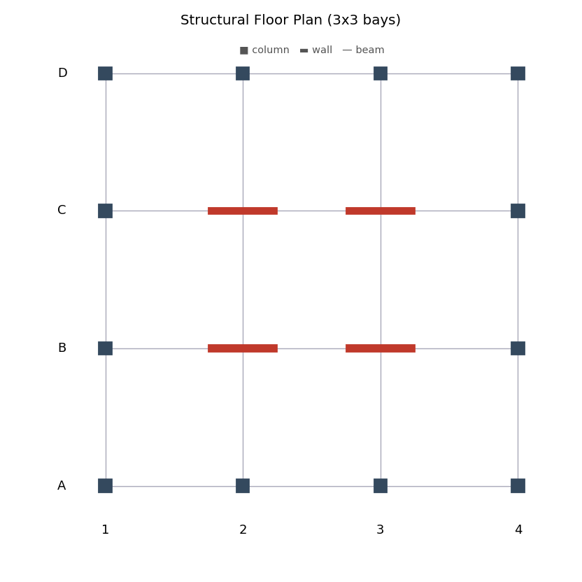
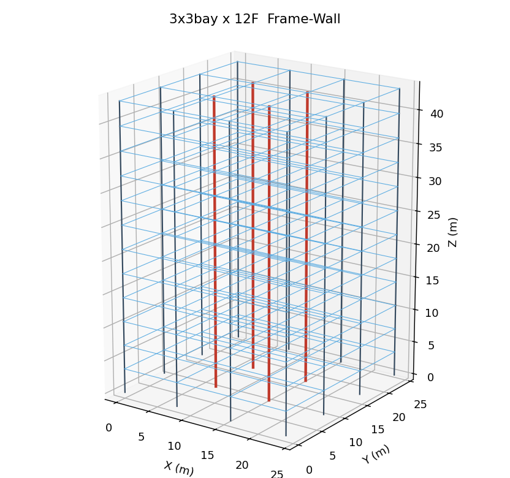
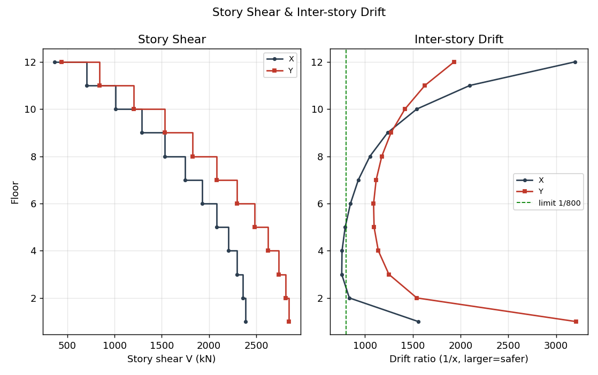
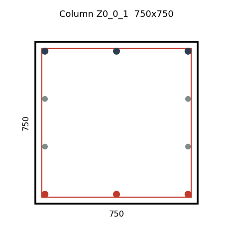

# 3×3跨×12层 框架-剪力墙　结构计算书

编制日期：2026-06-24　　计算软件：structdesign v0.17

---

## 一、工程概况

本工程为 多层/高层钢筋混凝土框架-剪力墙结构，平面 3×3 跨（柱距 8.0×8.0 m），共 12 层，层高 3.6 m，结构总高度 43.2 m。
抗侧力体系：框架-剪力墙（钢筋混凝土）。核心墙 4 处。

## 二、设计依据

- 《建筑结构荷载规范》GB 50009-2012
- 《混凝土结构设计规范》GB 50010-2010(2015年版)
- 《建筑抗震设计规范》GB 50011-2010(2016年版)
- 《高层建筑混凝土结构技术规程》JGJ 3-2010
- 《建筑地基基础设计规范》GB 50007-2011

## 三、材料

- 混凝土：柱/墙 C40，梁/板 C30
- 钢筋：纵筋 HRB400，箍筋 HPB300/HRB400

## 四、荷载与地震参数

- 楼面恒载 6.0 kN/m²，活载 2.5 kN/m²；荷载组合按 GB 50009（γG=1.3，γQ=1.5）。
- 抗震设防：地震影响系数最大值 αmax=0.16，特征周期 Tg=0.45 s，抗震等级 二级，阻尼比 ζ=0.05。
- 重力荷载代表值：每层 418 t。

## 五、计算模型与方法

采用三维空间杆系模型，每节点 6 个自由度，梁柱为空间梁单元（含双向弯曲与扭转），剪力墙采用等效宽柱模拟；楼盖按平面内刚性假定（每层 3 个自由度 UX/UY/RZ）。
水平地震作用采用**振型分解反应谱法**（GB 50011 5.2.2），各振型反应按**完全二次型 CQC 法**组合（考虑平动-扭转耦联），两个方向按0.85 规则组合（GB 50011 5.2.3）。竖向荷载下另计 P-Δ 二阶效应与整体稳定。

## 六、自振周期、振型与地震作用

| 振型 | 周期 T(s) | 振型类别 |
|------|----------|----------|
| 1 | 1.423 | X |
| 2 | 1.280 | 扭转 |
| 3 | 1.058 | Y |
| 4 | 0.459 | X |
| 5 | 0.397 | 扭转 |
| 6 | 0.273 | Y |
| 7 | 0.258 | X |
| 8 | 0.211 | 扭转 |
| 9 | 0.171 | X |

第一平动周期 T1=1.423 s（X）/ 1.058 s（Y）；第一扭转周期 Tt=1.280 s。
**周期比 Tt/T1 = 0.899**（GB 50011 3.4.5，限值 0.90）。

基底剪力（CQC 组合）：Vx=2388 kN，Vy=2846 kN，双向组合 3496 kN。
**剪重比 = 4.86%**（GB 50011 5.2.5，二级最小值约 1.6%）。

## 七、水平位移验算

- **最大层间位移角** = 1/875（GB 50011 5.5.1，框架-剪力墙限值 1/800）。
- **位移比** X=1.00，Y=1.00（GB 50011 3.4.3，限值 1.2，超 1.5 不应采用）。

## 八、整体稳定与二阶效应

竖向荷载下结构整体稳定满足要求；重力在水平位移上引起的 P-Δ 二阶效应已在分析中按几何刚度计入（GB 50011 3.6.3、JGJ 3-2010 5.4）。

## 九、构件承载力与配筋

### 9.1 框架柱（双向偏心受压，GB 50010 6.2.17）

| 编号 | 截面 | N(kN) | Mx(kN·m) | My(kN·m) | 轴压比 | 纵筋 | 配筋率 | 结论 |
|------|------|-------|----------|----------|--------|------|--------|------|
| Z0_0_1 | 750.0×750.0 | 2200 | 338 | 454 | 0.20 | 4×2D28 | 0.70% | ✔ |
| Z0_0_2 | 750.0×750.0 | 2016 | 191 | 250 | 0.19 | 4×2D28 | 0.70% | ✔ |
| Z0_0_3 | 750.0×750.0 | 1832 | 158 | 194 | 0.17 | 4×2D28 | 0.70% | ✔ |
| Z0_0_4 | 750.0×750.0 | 1648 | 145 | 182 | 0.15 | 4×2D28 | 0.70% | ✔ |
| Z0_0_5 | 750.0×750.0 | 1464 | 139 | 175 | 0.14 | 4×2D28 | 0.70% | ✔ |
| Z0_0_6 | 750.0×750.0 | 1280 | 135 | 170 | 0.12 | 4×2D28 | 0.70% | ✔ |
| Z0_0_7 | 750.0×750.0 | 1097 | 139 | 166 | 0.10 | 4×2D28 | 0.70% | ✔ |
| Z0_0_8 | 750.0×750.0 | 914 | 141 | 154 | 0.09 | 4×2D28 | 0.70% | ✔ |
| Z0_0_9 | 750.0×750.0 | 731 | 132 | 137 | 0.07 | 4×2D28 | 0.70% | ✔ |
| Z0_0_10 | 750.0×750.0 | 548 | 122 | 124 | 0.05 | 4×2D28 | 0.70% | ✔ |
| Z0_0_11 | 750.0×750.0 | 366 | 113 | 106 | 0.03 | 4×2D28 | 0.70% | ✔ |
| Z0_0_12 | 750.0×750.0 | 183 | 69 | 58 | 0.02 | 4×2D28 | 0.70% | ✔ |
| Z0_1_1 | 750.0×750.0 | 2118 | 377 | 468 | 0.20 | 4×2D28 | 0.70% | ✔ |
| Z0_1_2 | 750.0×750.0 | 1935 | 294 | 248 | 0.18 | 4×2D28 | 0.70% | ✔ |
| Z0_1_3 | 750.0×750.0 | 1754 | 272 | 192 | 0.16 | 4×2D28 | 0.70% | ✔ |
| Z0_1_4 | 750.0×750.0 | 1574 | 259 | 182 | 0.15 | 4×2D28 | 0.70% | ✔ |

### 9.2 剪力墙墙肢（GB 50011 6.4，GB 50010 6.2）

| 编号 | 截面 | N(kN) | 面内M(kN·m) | 轴压比 | 竖向分布筋 | 边缘构件 | 结论 |
|------|------|-------|------------|--------|-----------|----------|------|
| Z1_1_1 | 400.0×4000.0 | 2441 | 6422 | 0.08 | D8@100(双层, ρ=0.25%) | 3D25 | ✔ |
| Z1_1_2 | 400.0×4000.0 | 2252 | 4931 | 0.07 | D8@100(双层, ρ=0.25%) | 3D25 | ✔ |
| Z1_1_3 | 400.0×4000.0 | 2059 | 3670 | 0.07 | D8@100(双层, ρ=0.25%) | 3D25 | ✔ |
| Z1_1_4 | 400.0×4000.0 | 1862 | 2700 | 0.06 | D8@100(双层, ρ=0.25%) | 3D25 | ✔ |
| Z1_1_5 | 400.0×4000.0 | 1663 | 1953 | 0.05 | D8@100(双层, ρ=0.25%) | 3D25 | ✔ |
| Z1_1_6 | 400.0×4000.0 | 1460 | 1380 | 0.05 | D8@100(双层, ρ=0.25%) | 3D25 | ✔ |
| Z1_1_7 | 400.0×4000.0 | 1256 | 1047 | 0.04 | D8@100(双层, ρ=0.25%) | 3D25 | ✔ |
| Z1_1_8 | 400.0×4000.0 | 1049 | 1222 | 0.03 | D8@100(双层, ρ=0.25%) | 3D25 | ✔ |
| Z1_1_9 | 400.0×4000.0 | 840 | 1242 | 0.03 | D8@100(双层, ρ=0.25%) | 3D25 | ✔ |
| Z1_1_10 | 400.0×4000.0 | 631 | 1123 | 0.02 | D8@100(双层, ρ=0.25%) | 3D25 | ✔ |
| Z1_1_11 | 400.0×4000.0 | 420 | 861 | 0.01 | D8@100(双层, ρ=0.25%) | 3D25 | ✔ |
| Z1_1_12 | 400.0×4000.0 | 208 | 417 | 0.01 | D8@100(双层, ρ=0.25%) | 3D25 | ✔ |

### 9.3 框架梁（正截面受弯，GB 50010 6.2.10）

| 编号 | 截面 | M(kN·m) | 纵筋As(mm²) | 配筋 | 结论 |
|------|------|---------|------------|------|------|
| LX0_0_1 | 350.0×750.0 | 263 | 1089 | 2D28 | ✔ |
| LX1_0_1 | 350.0×750.0 | 247 | 1019 | 2D28 | ✔ |
| LX2_0_1 | 350.0×750.0 | 263 | 1089 | 2D28 | ✔ |
| LX0_1_1 | 350.0×750.0 | 273 | 1132 | 2D28 | ✔ |
| LX1_1_1 | 350.0×750.0 | 241 | 991 | 2D28 | ✔ |
| LX2_1_1 | 350.0×750.0 | 273 | 1132 | 2D28 | ✔ |
| LX0_2_1 | 350.0×750.0 | 273 | 1132 | 2D28 | ✔ |
| LX1_2_1 | 350.0×750.0 | 241 | 991 | 2D28 | ✔ |
| LX2_2_1 | 350.0×750.0 | 273 | 1132 | 2D28 | ✔ |
| LX0_3_1 | 350.0×750.0 | 263 | 1089 | 2D28 | ✔ |
| LX1_3_1 | 350.0×750.0 | 247 | 1019 | 2D28 | ✔ |
| LX2_3_1 | 350.0×750.0 | 263 | 1089 | 2D28 | ✔ |

## 十、规范控制指标汇总

| 控制指标 | 计算值 | 限值 | 结论 |
|----------|--------|------|------|
| 周期比 Tt/T1 | 0.899 | ≤0.90 | ✔满足 |
| 位移比(X) | 1.00 | ≤1.2 | ✔满足 |
| 位移比(Y) | 1.00 | ≤1.2 | ✔满足 |
| 剪重比 | 4.86% | ≥1.6% | ✔满足 |
| 最大层间位移角 | 1/875 | ≤1/800 | ✔满足 |

## 十一、结论

竖向构件 192 个、梁 288 个；其中不满足 0 个。主要规范控制指标均满足要求。
竖向构件纵筋估算用量约 **19.5 t**。

> **说明**：本计算书由 structdesign 自动生成，采用三维刚性楼盖模型、振型分解反应谱+CQC、柱双偏压与墙肢三维内力配筋。计算结果为方案/初步设计深度，施工图阶段应采用经审定的商业三维分析软件复核，并由具备资质的注册结构工程师审核、签字并对工程安全负责。
